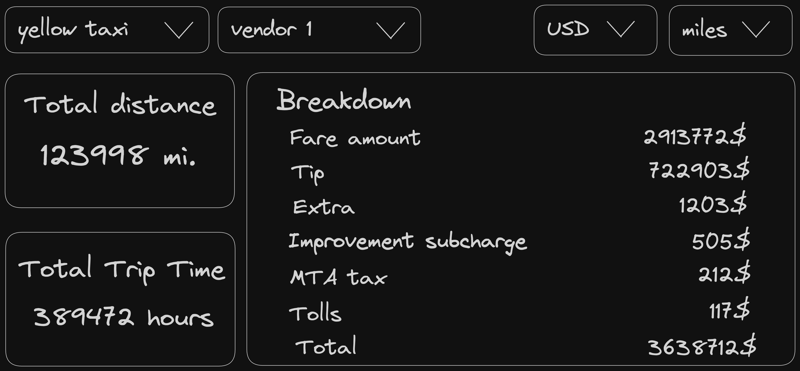

# Pyne Tech Challenge: Fullstack Application Development 🚀

## Challenge Overview 📊

Your task is to develop a fullstack application that presents a dashboard displaying metrics of New York City taxi trips. This project is estimated to take between 2 to 4 hours.

### Technologies Provided 🛠

We've set up the fundamental tools for you, allowing you to concentrate on the task at hand. However, you're welcome to switch out any of these technologies according to your preference.

- **Frontend Technologies**
  - [React](https://www.npmjs.com/package/react) - For building the user interface.
  - [Tailwind](https://github.com/tailwindlabs/tailwindcss) - For styling the components.
- **Backend Technologies**
  - [Express](https://www.npmjs.com/package/express) - As the web server framework.
  - [Prisma](https://www.npmjs.com/package/prisma) - For database management.
  - [ParquetJS](https://www.npmjs.com/package/@dsnp/parquetjs) - For parsing the dataset

> We recommend installing [parquet-viewer](https://marketplace.visualstudio.com/items?itemName=dvirtz.parquet-viewer) extension for VSCode to preview the dataset.

### Functional Requirements ✅

You will implement a dashboard based on the provided sketch above. The dashboard should enable users to:

- Filter data by:
  - Taxi type (options: `all`, `yellow taxi`, `green taxi`)
  - Vendor (options: `all`, `vendor 1`, `vendor 2`)
- View the total distance of trips.
- View the total time of trips.
- See a breakdown of trip fees, also sorted in descending order, with the total amount displayed at the bottom.
- Toggle the metric unit between `miles` and `km`.

Bonus Feature 🌟:

- Implement a feature to switch the currency between `USD` and `EUR`, which should be handled on the backend using any free currency conversion API.

### Non-Functional Requirements 📝

- Conversion between metric units should be performed on the backend.
- The design of the dashboard does not need to be complex, but it should be user-friendly and decent.

### Project Structure 📂

- The dataset is located in the `data/` directory.
- Define database tables using `prisma/schema.prisma`. Use `npm run migrate` to generate and apply migrations after modifying the schema.
- Data loading should be implemented in `src/scripts/seed.ts`. Execute seeding with `npm run seed`.
- Implement API endpoints in `src/server/main.ts`. Feel free to reorganize files and folders as you see fit for the project.
- Develop the frontend within `src/client`, adjusting files and folders according to what best suits the implementation of the task.

### Taxi trip dataset columns

> Note: Please be aware that column names may vary between the green and yellow taxi data. Columns with differing names are marked with the `⚠️` symbol below.

| Column Name                                    | Description                                                                                                                                                                                                                                                     | Type            |
| ---------------------------------------------- | --------------------------------------------------------------------------------------------------------------------------------------------------------------------------------------------------------------------------------------------------------------- | --------------- |
| VendorID                                       | A code indicating the LPEP provider that provided the record. 1= Creative Mobile Technologies, LLC; 2= VeriFone Inc.                                                                                                                                            | Number          |
| ⚠️ tpep_pickup_datetime/lpep_pickup_datetime   | The date and time when the meter was engaged.                                                                                                                                                                                                                   | DateTime        |
| ⚠️ tpep_dropoff_datetime/lpep_dropoff_datetime | The date and time when the meter was disengaged.                                                                                                                                                                                                                | DateTime        |
| passenger_count                                | The number of passengers in the vehicle.                                                                                                                                                                                                                        | Number          |
| trip_distance                                  | The elapsed trip distance in miles reported by the taximeter                                                                                                                                                                                                    | Floating number |
| RatecodeID                                     | The final rate code in effect at the end of the trip. 1= Standard rate; 2= JFK; 3= Newark; 4= Nassau or Westchester; 5= Negotiated fare; 6= Group ride                                                                                                          | Number          |
| store_and_fwd_flag                             | This flag indicates whether the trip record was held in vehicle memory before sending to the vendor, also known as “store and forward,” because the vehicle did not have a connection to the server. Y= store and forward trip; N= not a store and forward trip | Plain Text      |
| PULocationID                                   | TLC Taxi Zone in which the taximeter was engaged                                                                                                                                                                                                                | Number          |
| DOLocationID                                   | TLC Taxi Zone in which the taximeter was disengaged                                                                                                                                                                                                             | Number          |
| payment_type                                   | A numeric code signifying how the passenger paid for the trip. 1= Credit card; 2= Cash; 3= No charge; 4= Dispute; 5= Unknown; 6= Voided trip                                                                                                                    | Number          |
| fare_amount                                    | The time-and-distance fare calculated by the meter                                                                                                                                                                                                              | Floating Number |
| extra                                          | Miscellaneous extras and surcharges. Currently, this only includes the $0.50 and $1 rush hour and overnight charges                                                                                                                                             | Floating Number |
| mta_tax                                        | $0.50 MTA tax that is automatically triggered based on the metered rate in use.                                                                                                                                                                                 | Floating Number |
| tip_amount                                     | This field is automatically populated for credit card tips. Cash tips are not included                                                                                                                                                                          | Floating Number |
| tolls_amount                                   | Total amount of all tolls paid in trip                                                                                                                                                                                                                          | Floating Number |
| improvement_surcharge                          | $0.30 improvement surcharge assessed trips at the flag drop. The improvement surcharge began being levied in 2015                                                                                                                                               | Number          |
| total_amount                                   | Total amount of all tolls paid in trip                                                                                                                                                                                                                          | Floating Number |

# How to run

run the following from project root:

1. `cp .env.example .env`
2. `docker-compose up -d`
3. `npm run seed`
4. `npm run dev`
